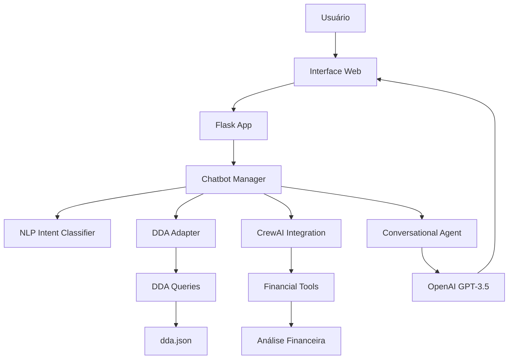

# 💰 Quitador - Assistente Financeiro BTG


<div align="center">
  
  
  
  
</div>

## 🎯 O que é o Quitador?

O **Quitador** é um assistente financeiro inteligente desenvolvido para o hackathon BTG, que simula um chatbot especializado em gestão de pagamentos de boletos. Utilizando inteligência artificial avançada, o sistema oferece análises financeiras personalizadas e estratégias de pagamento otimizadas.

### ✨ Principais Funcionalidades

- 🤖 **Chat Conversacional**: Interface similar ao WhatsApp com IA natural
- 📊 **Análise de Boletos**: Consulta de boletos por data e período
- 💡 **Sugestões Inteligentes**: Estratégias de pagamento baseadas em IA
- 💰 **Financiamento Inteligente**: Capital de giro, adiantamento de recebíveis e pagamento parcial
- 📈 **Dashboard Financeiro**: Visão de períodos e urgência de pagamentos
- 🎭 **Persona Quitador**: Assistente especializado com personalidade própria

## 🏗️ Arquitetura do Sistema

### 📁 Estrutura do Projeto

```
Pagamento - BTG/
├── chatbot/                    # Aplicação principal do chatbot
│   ├── app.py                 # Servidor Flask
│   ├── chatbot_manager.py     # Lógica principal do chatbot
│   ├── conversational_agent.py # Geração de respostas com LLM
│   ├── nlp_intent.py          # Classificação de intenções
│   ├── dda_crew_adapter.py    # Adaptador para dados DDA
│   ├── crew_integration.py    # Integração com CrewAI
│   ├── templates/
│   │   └── index.html         # Interface web (WhatsApp-like)
│   ├── static/
│   │   └── photos/
│   │       └── profile.jpeg    # Foto do Quitador
│   └── requirements.txt       # Dependências Python
├── DDA/                       # Módulo de consulta de boletos
│   ├── queries_dda.py         # Funções de consulta
│   └── dda.json              # Mock de base de dados de boletos
├── Sugestao-acao/             # Módulo de análise financeira
│   ├── financial_tools_simple.py # Ferramentas financeiras
│   ├── crew.py               # Configuração CrewAI
│   └── boletos.json          # Dados para análise
└── README.md                 # Este arquivo
```

### 🔧 Tecnologias Utilizadas

| Tecnologia | Versão | Propósito |
|------------|--------|-----------|
| **Python** | 3.12+ | Linguagem principal |
| **Flask** | 2.0+ | Framework web |
| **OpenAI GPT-3.5** | - | Geração de respostas conversacionais |
| **CrewAI** | 0.28+ | Framework de agentes IA |
| **Pandas** | - | Manipulação de dados |
| **LangChain** | 0.1+ | Integração com LLMs |

### 🧠 Visão Geral de Funcionamento



### 🔄 Fluxo de Funcionamento

1. **Entrada do Usuário**: Mensagem via interface web
2. **Classificação de Intenção**: NLP identifica o que o usuário quer
3. **Processamento**: Sistema consulta dados DDA e executa análise
4. **Geração de Resposta**: IA gera resposta conversacional personalizada
5. **Apresentação**: Interface exibe resposta no formato WhatsApp

## 🚀 Como Executar

### 📋 Pré-requisitos

- Python 3.12 ou superior
- Chave de API da OpenAI
- Git (para clonar o repositório)

### 🔑 Configuração da API Key

1. Crie um arquivo `.env` na pasta `chatbot/`:
```bash
cd chatbot/
touch .env
```

2. Adicione sua chave da OpenAI:
```env
OPENAI_API_KEY=sua_chave_aqui
```

### ⚙️ Instalação e Execução

1. **Clone o repositório**:
```bash
git clone <url-do-repositorio>
cd "Pagamento - BTG"
```

2. **Crie e ative o ambiente virtual**:
```bash
python3 -m venv venv
source venv/bin/activate  # Linux/Mac
# ou
venv\Scripts\activate     # Windows
```

3. **Instale as dependências**:
```bash
cd chatbot/
pip install -r requirements.txt
```

4. **Execute a aplicação**:
```bash
python app.py
```

5. **Acesse no navegador**:
```
http://localhost:5000
```

### 🐳 Execução Rápida (Script Automatizado)

Execute o script de setup automático:
```bash
cd chatbot/
chmod +x setup.sh
./setup.sh
```

## 💡 Funcionalidades Detalhadas

### 🗣️ Chat Conversacional
- Interface similar ao WhatsApp
- Respostas naturais geradas por IA
- Persona "Quitador" especializada
- Reconhecimento de intenções avançado

### 📊 Consulta de Boletos
- **Visão do Dia**: Boletos vencendo hoje + vencidos
- **Visão de Período**: Análise de intervalos de tempo
- **Detalhes Específicos**: Informações detalhadas de cada boleto
- **Filtros Inteligentes**: Boletos já pagos são automaticamente filtrados

### 💰 Estratégias de Financiamento
- **Capital de Giro**: Taxa de 8% ao ano
- **Adiantamento de Recebíveis**: Taxa de 15% ao ano
- **Pagamento Parcial Inteligente**: Otimização baseada em custo-benefício
- **Análise Comparativa**: Comparação automática de todas as opções

### 🎯 Análise Inteligente
- **Priorização por Juros**: Boletos com maior custo são priorizados
- **Simulação de Cenários**: Múltiplas estratégias analisadas
- **Recomendação Automática**: Melhor opção apresentada automaticamente
- **Contextualização**: Beneficiários específicos para loja de roupas

## 🧪 Exemplos de Uso

### 💬 Conversas Típicas

**Usuário**: "Bom dia, quero ver meus boletos de hoje"
**Quitador**: "Olá, Célia! Hoje você tem 1 boleto vencendo de Energia Elétrica para a Loja, no valor de R$ 3,200.50. Além disso, até hoje, você tem 6 boletos vencidos com um total de R$ 10,370.25. Seu saldo disponível é de R$ 10,000.00..."

**Usuário**: "Gostaria de seguir sua sugestão"
**Quitador**: "Perfeito! Executando Pagamento Parcial Inteligente: pagando R$ 9,700.50 agora e deixando R$ 3,870.25 para amanhã. Custo de juros: apenas R$ 38.70..."

### 📈 Cenários de Análise

- **Saldo Suficiente**: Pagamento direto recomendado
- **Saldo Insuficiente**: Estratégias de financiamento apresentadas
- **Múltiplas Opções**: Comparação detalhada de custos
- **Pagamento Parcial**: Otimização inteligente de recursos


## 👥 Equipe RAIA


Membros
**Artur De Vlieger Lima**
**Beatriz Lomes da Silva** 
**Lucas de Souza Brandão** 
**Pedro Augusto Monteiro Delgado**


## Demonstração 


https://github.com/user-attachments/assets/2741b295-0424-4aa5-809a-767027bb6251


## 📄 Licença

Este projeto foi desenvolvido para o Hackathon BTG e está sob licença MIT.

---

<div align="center">
  <p><strong>Desenvolvido com ❤️ pela Equipe RAIA</strong></p>
  <p><em>Transformando ideias em soluções financeiras inteligentes</em></p>
</div>
